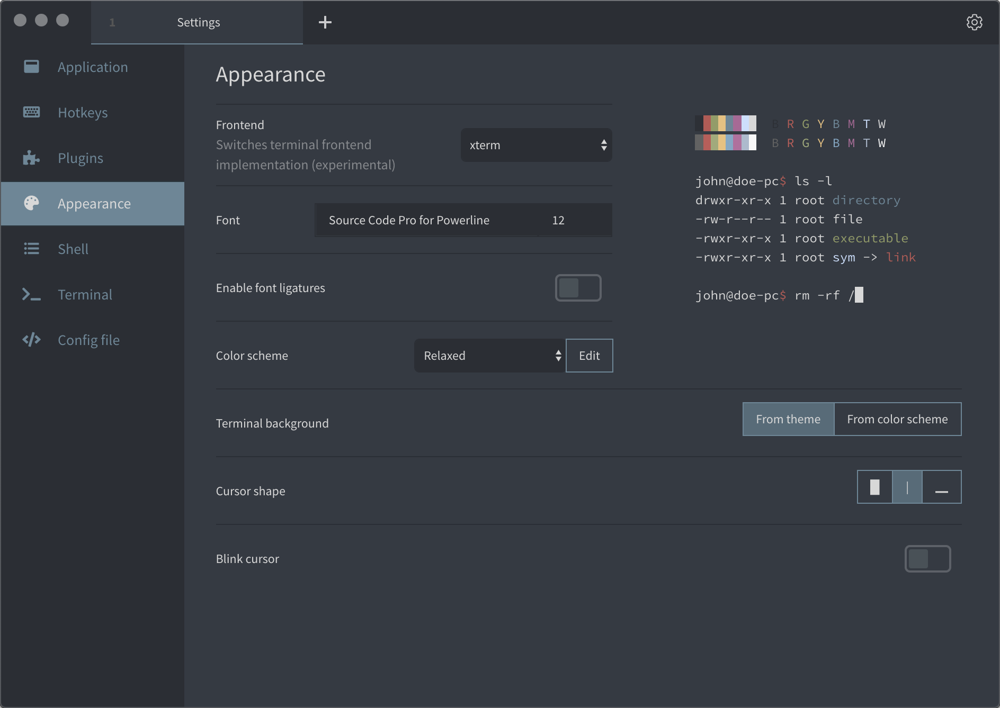

# Relaxed Theme for Terminus

> A relaxed Terminus theme to take a more relaxed view of things. Also available for iTerm, Hyper, the macOS Terminal and a bunch of others.

## Install
To install Relaxed for Terminus:

1. Go to Plugins in Settings.
1. Install `terminus-relaxed-theme` in the available plugins and restart.
1. Select »Relaxed« in the Theme Dropdown menu.
1. Go to Appearance in Settings.
1. Select »Relaxed« in the Colornscheme Dropdown menu.
1. Enjoy.

## Related

- [relaxed-terminal-themes](https://github.com/Relaxed-Theme/relaxed-terminal-themes#readme) - Relaxed Theme for macOS Terminal, iTerm, Hyper and bunch of other Terminal emulators.
- [atom-relaxed-syntax](https://github.com/Relaxed-Theme/atom-relaxed-syntax) - Relaxed Theme for Atom.
- [vscode-theme-relaxed](https://github.com/Relaxed-Theme/vscode-theme-relaxed) - Relaxed Theme for Visual Studio Code.

## License

Please be aware of the licenses of the components we use in this project.
Everything else that has been developed by the contributions to this project is under [MIT License](LICENSE).
